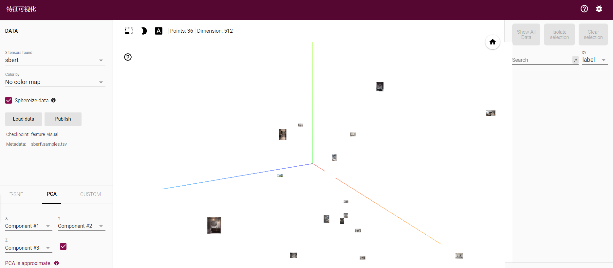

## Embedding Projector  

## 空间向量可视化

</br>


## 1. 生成config.json文件
```
    使用 data_prepare.py， 代码极其简单，可以看例子。
    例子：space.json or text.json to space/config.json or text/config.json
```
   
## 2. 可视化
```
    python -m projector_visualize
```
localhost:8000




